# Lagom Deep Mode - Fine-Tuning & Integration Guide
**Turn your 30,000 paired dataset into a custom fine-tuned LLM and serve it via API.**

---

## 🏗️ Architecture Overview

```mermaid
flowchart LR
    A["lagom_pairs.csv (30k Pairs)"] --> B["prepare_dataset.py"]
    B --> C["train_chatml.jsonl (90%)<br/>val_chatml.jsonl (10%)"]
    C --> D["Kaggle GPU Fine-Tuning<br/>(Unsloth 4-bit QLoRA)"]
    D --> E["Merged Model / GGUF<br/>(Hugging Face Hub)"]
    E --> F["FastAPI Inference Server<br/>(server/app.py)"]
    F --> G["Next.js Deep API Route<br/>(/api/humanize/deep)"]
    G --> H["Lagom Web Application UI"]
```



---

## 📋 Step-by-Step Workflow

### **Step 1: Prepare the Dataset**

Run the dataset preparation script locally in your repository:

```powershell
python training/prepare_dataset.py
```

* **Input**: [`lagom_pairs.csv`](file:///c:/ME/Project-Lagom/Data_Collection/lagom_pairs.csv)
* **Output**: Generated in `training/processed_data/`:
  * `train_chatml.jsonl` (Training split)
  * `val_chatml.jsonl` (Validation split)
  * `train_alpaca.jsonl` & `val_alpaca.jsonl` (Alternative format)

---

### **Step 2: Train on Kaggle (Free GPU)**

1. Open [Kaggle](https://www.kaggle.com/) and create a new **Notebook**.
2. **Notebook Settings** (Right Sidebar):
   * **Accelerator**: `GPU T4 x 2` or `GPU P100` (16GB VRAM)
   * **Internet**: `ON`
3. **Upload Dataset**:
   * Click **+ Add Data** $\rightarrow$ Upload your `train_chatml.jsonl` and `val_chatml.jsonl`.
4. **Copy & Run the Training Script**:
   * Copy the code from [`training/kaggle_train_unsloth.py`](file:///c:/ME/Project-Lagom/Data_Collection/training/kaggle_train_unsloth.py) into your Kaggle notebook cells.
   * **Key Training Hyperparameters**:
     * Base Model: `unsloth/Qwen2.5-7B-Instruct-bnb-4bit` (or `unsloth/Meta-Llama-3.1-8B-Instruct-bnb-4bit`)
     * Sequence Length: `2048`
     * LoRA: `r=16, alpha=32`
     * Batch Size: `2` with `gradient_accumulation_steps=4` (Effective batch size = 8)
     * Learning Rate: `2e-4` with Cosine decay
     * Epochs: `2` (approx. 45–60 minutes on Kaggle T4)

---

### **Step 3: Save & Export to Hugging Face Hub**

At the end of your Kaggle notebook, export and upload your model:

```python
from huggingface_hub import login
login(token="YOUR_HUGGINGFACE_WRITE_TOKEN")

# Push 16-bit merged model
model.push_to_hub_merged("your-username/lagom-deep-7b", tokenizer, save_method="merged_16bit")

# Optional: Export GGUF for local Ollama / CPU execution
model.save_pretrained_gguf("lagom_deep_gguf", tokenizer, quantization_method="q4_k_m")
```

---

### **Step 4: Run the Inference Server**

You can host your fine-tuned model using the included FastAPI server ([`server/app.py`](file:///c:/ME/Project-Lagom/Data_Collection/server/app.py)):

#### **Local GPU / Dev Testing:**
```powershell
pip install -r server/requirements.txt
python server/app.py
```

The server exposes:
* `POST /v1/humanize/deep` — Main humanization endpoint
* `GET /health` — Status and model health check

#### **Cloud Deployment:**
Deploy `server/app.py` to **Render, RunPod, Hugging Face Spaces (Gradio / Docker), or Fly.io**.

---

### **Step 5: Connect to Next.js Frontend**

1. Copy [`lib/deep_humanizer.ts`](file:///c:/ME/Project-Lagom/Data_Collection/lib/deep_humanizer.ts), [`prompts/deep_prompts.ts`](file:///c:/ME/Project-Lagom/Data_Collection/prompts/deep_prompts.ts), and [`app/api/humanize/deep/route.ts`](file:///c:/ME/Project-Lagom/Data_Collection/app/api/humanize/deep/route.ts) to your web app.
2. In your Next.js `.env.local`, configure:

```env
# URL of your deployed FastAPI server or Hugging Face Endpoint
LAGOM_DEEP_API_URL=http://localhost:8000
LAGOM_DEEP_MODEL_ID=your-username/lagom-deep-7b
HF_TOKEN=your_hf_token_here
```

3. Call from your frontend:

```typescript
const response = await fetch("/api/humanize/deep", {
  method: "POST",
  headers: { "Content-Type": "application/json" },
  body: JSON.stringify({
    text: "AI generated text here...",
    category: "essay", // "general" | "essay" | "academic" | "email" | "document"
    wordLimit: 1000,
  }),
});

const data = await response.json();
console.log(data.humanizedText);
console.log(data.originalScore, "->", data.humanizedScore);
```

---

## 📁 File Structure Created

```
Project-Lagom/Data_Collection/
├── training/
│   ├── prepare_dataset.py         # Converts CSV to ChatML/Alpaca JSONL
│   ├── kaggle_train_unsloth.py    # Complete Unsloth QLoRA training script
│   └── processed_data/            # Output train/val JSONL splits
├── server/
│   ├── app.py                     # FastAPI production inference server
│   └── requirements.txt           # Inference dependencies
├── prompts/
│   └── deep_prompts.ts            # ChatML prompt templates for TypeScript
├── lib/
│   └── deep_humanizer.ts          # Client library for Deep Mode API calls
├── app/api/humanize/deep/
│   └── route.ts                   # Next.js App Router POST endpoint
└── DEEP_MODE_GUIDE.md             # Master walkthrough documentation
```
